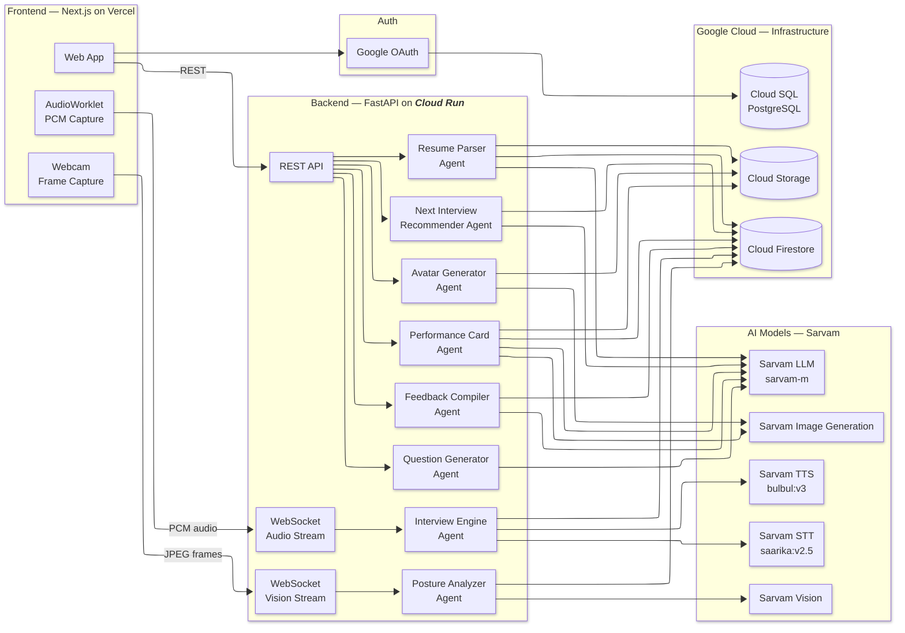
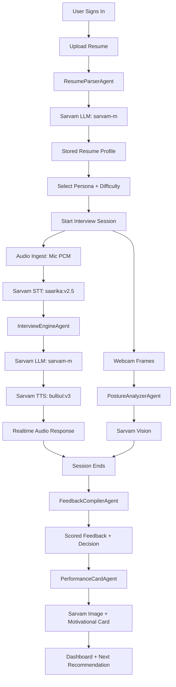
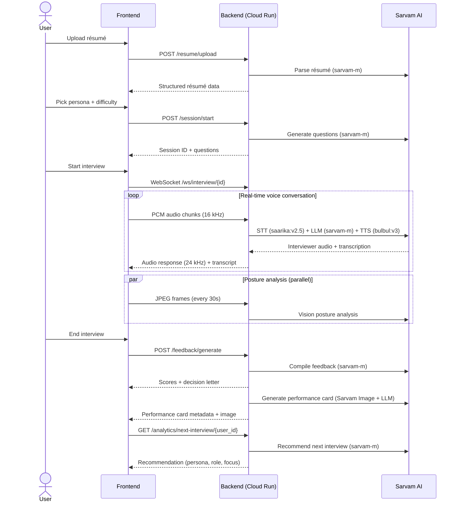
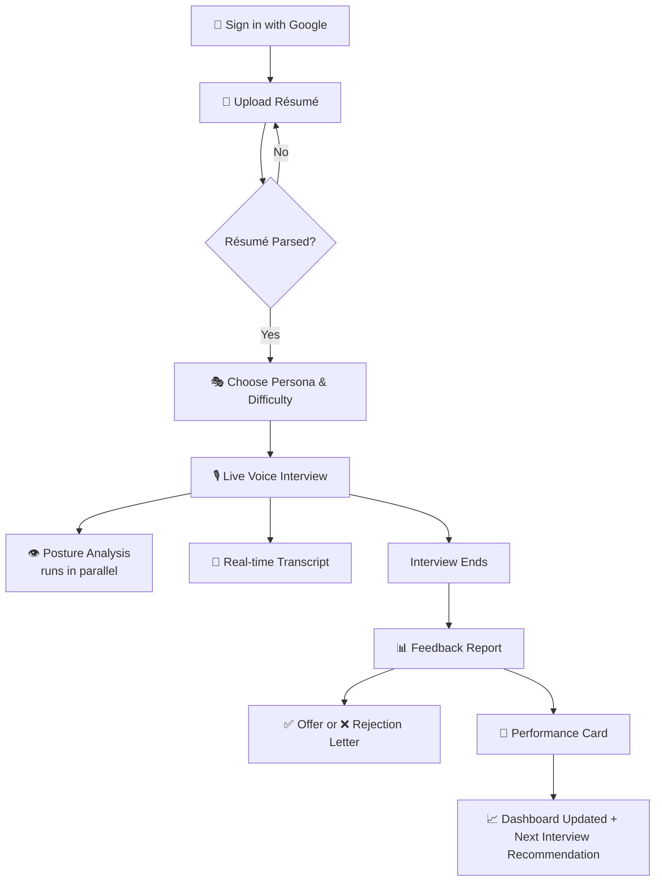

# MockMate

> **Interview practice, without the nerves.**

MockMate is an AI-powered mock interview platform that conducts real, adaptive interview sessions using **voice**, **vision**, and **résumé-personalized** question generation. It analyzes not just _what_ you say but _how_ you say it — scoring your tone, posture, vocabulary, and confidence in real time. At the end of every session, you receive a detailed feedback report and a mock hiring decision letter, so you walk into every real interview already knowing how it ends.


## 🎯 The Problem

Job interviews are high-stakes and almost impossible to practice realistically. Candidates rehearse alone in mirrors or pay hundreds for coaching they can only afford once. Existing AI platforms are text-based, generic, or only evaluate _after_ the session. None simulate the real emotional dynamics of a live interview — the pressure, the follow-ups, the silence. None of them _see_ you. And none tell you honestly whether you would have gotten the job.

## 💡 The Solution

MockMate is a real-time AI interview coach. Upload your résumé → pick an interviewer persona → sit down and talk. MockMate interviews you live with voice, watches your body language through your webcam, and at the end delivers a full multimodal feedback report with a mock hiring decision letter.

```
Upload Résumé  →  Pick Persona & Difficulty  →  Live Voice Interview  →  Get Feedback + Decision Letter
```

---

## ✨ Key Features

| Feature | Description |
|---------|-------------|
| 📄 **Résumé-Aware Questions** | Reads your actual résumé and generates hyper-personalized questions. Claim you led a team of 30? Expect to be asked how you handled underperformance. |
| 🎭 **13 Interviewer Personas** | From a warm HR manager to an aggressive investment banker, an algorithm guru to a system designer — each with distinct questioning styles, pressure levels, speech patterns, and follow-up behaviors. |
| ⚡ **Adaptive Follow-ups** | The interviewer asks probing follow-ups, challenges weak answers, and digs deeper into your claims — just like a real interviewer would. |
| 👁️ **Posture & Presence Vision** | Webcam-based scoring of posture, eye contact, and facial confidence in real time. |
| 🎙️ **Live Voice Stack** | Real-time bidirectional interview powered by Sarvam STT/TTS + orchestration. |
| 📬 **Mock Hiring Decision** | A simulated offer or rejection letter with personalized reasoning — making feedback feel consequential. |
| 📈 **Skill Progression Dashboard** | Tracks improvement across communication, confidence, structure, technical depth, and domain vocabulary over time. |
| 🪧 **AI Performance Card** | Generates a unique artistic background themed to persona, role, and score, then overlays a motivational line. Card can be downloaded or shared to LinkedIn. |
| 🧭 **Next Interview Recommender** | Sarvam LLM analyzes recent sessions to surface your weakest dimension and recommends persona, role, and practice focus for your next interview. |
| 🌗 **Dark Mode** | Full dark/light/system theme support across the entire application. |

---

## 🏗 Architecture

### System Architecture Diagram



---

## 🔄 System Flowchart



### Agent Pipeline

The backend is composed of **8 specialized AI agents**, each handling a distinct part of the interview workflow:

| Agent | Model Used | What It Does |
|-------|-----------|-------------|
| **ResumeParserAgent** | Sarvam LLM (`sarvam-m`) | Extracts structured JSON from PDF/DOCX résumés, stores raw files in Cloud Storage, persists structured data in Firestore |
| **QuestionGeneratorAgent** | Sarvam LLM (`sarvam-m`) | Generates personalized interview questions based on résumé, persona, and difficulty |
| **InterviewEngineAgent** | Sarvam STT (`saarika:v2.5`) + Sarvam TTS (`bulbul:v3`) + Sarvam LLM (`sarvam-m`) | Manages live bidirectional voice interview sessions, adaptive follow-ups, interruption support, and transcript persistence |
| **PostureAnalyzerAgent** | Sarvam Vision API | Scores posture, eye contact, and facial confidence from webcam frames captured every 20 seconds |
| **FeedbackCompilerAgent** | Sarvam LLM (`sarvam-m`) | Aggregates transcript, posture data, and session metadata to produce scored feedback and a mock hiring decision letter |
| **PerformanceCardAgent** | Sarvam LLM + Sarvam Image Generation | Generates a unique AI performance card per session with a themed background and motivational line, cached in GCS + Firestore |
| **NextInterviewRecommenderAgent** | Sarvam LLM (`sarvam-m`) | Analyzes recent sessions to identify weakest dimensions and recommends a targeted next interview |
| **InterviewerAvatarAgent** | Sarvam Image Generation | Generates and caches AI profile pictures for each interviewer persona |



---

## 🛠 Technologies Used


### Application Stack

| Layer | Technology |
|-------|-----------|
| **Frontend** | Next.js 16 (App Router, Turbopack), React 19, TailwindCSS 4, shadcn/ui (Radix), TanStack Query |
| **Backend** | FastAPI, Python 3.13, WebSockets, Uvicorn |
| **Auth** | Better Auth with Google OAuth → Cloud SQL (PostgreSQL) |
| **Real-time Audio** | Browser AudioWorklet (PCM Int16 @ 16 kHz capture, 24 kHz playback) |
| **Real-time Video** | react-webcam (640×480 JPEG frames every 20 seconds) |
| **Deployment** | Cloud Run (backend), Vercel (frontend) |

---

## 🚀 Quick Start (Local Setup)

### Prerequisites

| Tool | Version | Why | Install |
|------|---------|-----|---------|
| **Python** | 3.13 | Backend runtime. Pre-built wheels for all deps. | [python.org/downloads](https://www.python.org/downloads/) |
| **Node.js** | 18+ | Frontend runtime | [nodejs.org](https://nodejs.org/) |
| **Google Cloud SDK** | latest | Auth + deploy | [cloud.google.com/sdk](https://cloud.google.com/sdk/docs/install) |
| **PostgreSQL** | 14+ | Better Auth session storage | [pgadmin.org](https://www.pgadmin.org/download/) |

You also need a **Google Cloud project** with the following APIs enabled:
- Cloud Firestore API
- Cloud Storage API

You also need a **Sarvam API key** for LLM/STT/TTS/Vision/Image services used by the agent pipeline.

And a **Google OAuth 2.0 Client ID** (for user login).

### Step 1 — Clone the repository

```bash
git clone https://github.com/mockmate-app/mockmate.git
cd mockmate
```

### Step 2 — Provision Google Cloud resources first

Before creating `.env` files, provision the required GCP resources and APIs:

- Enable APIs: **Cloud Firestore API**, **Cloud Storage API**, **Cloud SQL Admin API**
- Create a **Firestore database** (Native mode)
- Create a **Cloud SQL for PostgreSQL instance** (for app/auth data)
- Create a **Cloud Storage bucket** (for résumé files and generated assets)

After provisioning, populate backend/frontend `.env` files with these resource names (project ID, bucket, region, OAuth creds, Cloud SQL host/db/user/password).

### Step 3 — Set up the backend

```bash
cd backend

# Create and activate a virtual environment
python3.13 -m venv .venv
source .venv/bin/activate        # macOS / Linux
# .venv\Scripts\activate         # Windows

# Install dependencies
pip install --upgrade pip
pip install -r requirements.txt

# Configure environment variables
cp .env.example .env
# Open .env and fill in your GCP project ID, region, bucket name,
# Postgres credentials, and other values. See .env.example for guidance.

# Authenticate with Google Cloud
gcloud auth application-default login
gcloud config set project YOUR_PROJECT_ID
gcloud auth application-default set-quota-project YOUR_PROJECT_ID

# Start the server
python main.py
# Backend is now running at http://localhost:8080
# Interactive API docs at http://localhost:8080/docs
```

### Step 4 — Set up the frontend

```bash
cd frontend

# Install dependencies
npm install

# Configure environment variables
cp .env.example .env.local
# Open .env.local and fill in:
#   NEXT_PUBLIC_API_URL=http://localhost:8080
#   BETTER_AUTH_SECRET, BETTER_AUTH_URL
#   GOOGLE_CLIENT_ID, GOOGLE_CLIENT_SECRET
#   PGHOST, PGPORT, PGUSER, PGPASSWORD, PGDATABASE

# Start the dev server
npm run dev
# Frontend is now running at http://localhost:3000
```

### Step 5 — Use MockMate

1. Open http://localhost:3000 in your browser
2. Sign in with Google
3. Upload your résumé (PDF or DOCX)
4. Choose an interviewer persona and difficulty level
5. Start the live voice interview — speak naturally through your microphone
6. When the interview ends, view your feedback report and mock hiring decision

> For more detailed setup instructions, see the [backend README](./backend/README.md) and [frontend README](./frontend/README.md).

---

## 📂 Project Structure

```
mockmate/
├── README.md                           # This file
├── LICENSE                             # MIT License
│
├── backend/                            # FastAPI backend (Python)
│   ├── main.py                         # REST + WebSocket endpoints, lifespan
│   ├── Dockerfile                      # Multi-stage production container
│   ├── requirements.txt                # Python dependencies
│   ├── deploy.sh                       # Backend deployment script (Cloud Run)
│   ├── .env.example                    # Environment variable template
│   └── agents/
│       ├── config.py                   # Shared configuration & env var loading
│       ├── resume_parser.py            # Résumé extraction with Sarvam LLM
│       ├── question_generator.py       # Personalized question generation
│       ├── interview_engine.py         # Live audio interview orchestration (Sarvam STT/TTS + LLM)
│       ├── posture_analyzer.py         # Webcam posture scoring via Sarvam Vision
│       ├── feedback_compiler.py        # Post-session feedback & decision letter
│       ├── performance_card.py         # AI performance card (Sarvam image generation + LLM)
│       ├── next_interview_recommender.py # Next interview recommendation engine
│       ├── interviewer_avatar.py       # AI avatar generation with Sarvam image model
│       └── personas.json              # 13 interviewer persona definitions
│
├── frontend/                           # Next.js web app (TypeScript)
│   ├── deploy.sh                       # Frontend deployment script (Vercel)
│   ├── src/
│   │   ├── app/                        # Pages (App Router)
│   │   │   ├── dashboard/              # Session history, stats, performance card, next-interview recommendation
│   │   │   ├── interview/
│   │   │   │   ├── setup/              # Persona & difficulty selection
│   │   │   │   ├── live/               # Real-time voice interview engine
│   │   │   │   └── feedback/           # Feedback report + full-size performance card
│   │   │   ├── resume/                 # Résumé upload & preview
│   │   │   ├── sessions/               # Full session history
│   │   │   └── login/                  # Google OAuth login
│   │   ├── components/                 # Reusable UI components (shadcn/ui, PerformanceCard)
│   │   ├── constants/common.ts         # Shared constants & helpers
│   │   └── lib/                        # API client, auth, utilities
│   ├── public/
│   │   └── audio-processor.worklet.js  # PCM audio capture worklet
│   ├── package.json
│   └── next.config.ts
│
└── deploy.sh                           # Full-stack deployment orchestrator
```

### Frontend → Vercel

The frontend is deployed on Vercel with environment variables configured in the Vercel dashboard:

```bash
cd frontend
npx vercel --prod
```

Set these environment variables in Vercel:
- `NEXT_PUBLIC_API_URL` → your Cloud Run backend URL (e.g., `https://mockmate-backend-xxxxx.run.app`)
- `BETTER_AUTH_SECRET`, `BETTER_AUTH_URL`, `GOOGLE_CLIENT_ID`, `GOOGLE_CLIENT_SECRET`
- PostgreSQL connection variables (`PGHOST`, `PGPORT`, `PGUSER`, `PGPASSWORD`, `PGDATABASE`)

---

## 🚀 Automating Cloud Deployment

Both the backend and frontend have **fully automated continuous deployments** linked directly to the GitHub repository:

| Service | Platform | Trigger | How |
|---------|----------|---------|-----|
| **Backend** | Google Cloud Run | Push to `main` (changes in `backend/`) | Cloud Run continuous deployment connected to GitHub via the GCP Console |
| **Frontend** | Vercel | Push to `main` (changes in `frontend/`) | Vercel Git integration connected to the GitHub repository |

Every push to `main` automatically builds and deploys the affected service — no manual steps required.


### Deployment Scripts

For local or manual deployments, each service also has its own deployment script:

```bash
# Deploy backend only (Cloud Run)
chmod +x backend/deploy.sh
./backend/deploy.sh

# Deploy frontend only (Vercel)
chmod +x frontend/deploy.sh
./frontend/deploy.sh

# Deploy both at once from repo root
chmod +x deploy.sh
./deploy.sh                 # deploys backend + frontend
./deploy.sh backend         # backend only
./deploy.sh frontend        # frontend only
```

> **Note:** The backend `deploy.sh` script parses `backend/.env` and passes every key-value pair to Cloud Run via `--set-env-vars`. Make sure your `.env` file is populated before deploying.

---

## ✅ Proof of Google Cloud Deployment

MockMate's backend runs entirely on Google Cloud. Here is the proof:

<!-- PLACEHOLDER: Add ONE of the following:
     Option 1: A short screen recording showing the Cloud Run service in the GCP Console
     Option 2: Links to code files that demonstrate GCP service usage
-->


**Code-level proof of Google Cloud service usage:**

| GCP Service | Code Pointer | What It Does |
|-------------|-------------|-------------|
| Sarvam LLM Integration | [`feedback_compiler.py`](https://github.com/mockmate-app/mockmate/blob/main/backend/agents/feedback_compiler.py) | Compiles post-interview feedback with Sarvam LLM |
| Cloud Firestore | [`interview_engine.py#L697`](https://github.com/mockmate-app/mockmate/blob/main/backend/agents/interview_engine.py#L697) | `firestore.AsyncClient()` for session state, transcripts, and posture scores |
| Cloud Firestore | [`config.py#L28-L33`](https://github.com/mockmate-app/mockmate/blob/main/backend/agents/config.py#L28-L33) | Centralised Firestore collection config used by all 6 agents |
| Cloud Storage | [`resume_parser.py#L165`](https://github.com/mockmate-app/mockmate/blob/main/backend/agents/resume_parser.py#L165) | `storage.Client()` for uploading raw résumé files to GCS |
| Cloud Storage | [`resume_parser.py#L265-L279`](https://github.com/mockmate-app/mockmate/blob/main/backend/agents/resume_parser.py#L265-L279) | `_upload_to_gcs()` — uploads file bytes and returns `gs://` URI |
| Cloud Pub/Sub | [`interview_engine.py#L698-L699`](https://github.com/mockmate-app/mockmate/blob/main/backend/agents/interview_engine.py#L698-L699) | `pubsub_v1.PublisherClient()` for session-end event publishing |
| Cloud Pub/Sub | [`interview_engine.py#L913`](https://github.com/mockmate-app/mockmate/blob/main/backend/agents/interview_engine.py#L913) | `self._publisher.publish()` fires session-end event |
| Sarvam Image Generation | [`interviewer_avatar.py`](https://github.com/mockmate-app/mockmate/blob/main/backend/agents/interviewer_avatar.py) | Generates and caches interviewer avatars |
| Cloud Run | [`Dockerfile`](https://github.com/mockmate-app/mockmate/blob/main/backend/Dockerfile) | Multi-stage production container for Cloud Run deployment |
| Cloud Run (deploy) | [`deploy.sh`](https://github.com/mockmate-app/mockmate/blob/main/deploy.sh) | Automated deployment script for Cloud Run with env var injection |

---

## 🎬 How It Works — User Flow

1. **Sign in** — Log in with your Google account (OAuth 2.0 via Better Auth).
2. **Upload résumé** — Drag and drop your PDF or DOCX. Sarvam LLM parses it into structured data (skills, experience, education, bold claims).
3. **Choose your interviewer** — Pick from 13 personas (e.g., Startup Founder, Investment Banker, Algorithm Guru) and set your difficulty level (easy, medium, hard).
4. **Live interview** — A real-time voice conversation begins. The AI interviewer asks personalized questions, follows up on your answers, challenges weak points, and adapts its questioning style based on your responses. Your webcam captures posture data in the background.
5. **Get feedback** — After the interview ends, Sarvam LLM compiles all data (transcript, posture scores, résumé context) into a detailed feedback report scoring you across 6 dimensions: communication, confidence, structure, technical depth, domain vocabulary, and posture.
6. **Hiring decision** — You receive a mock offer or rejection letter with specific reasoning, making the feedback feel real and consequential.
7. **Performance card** — An AI-generated card with a unique themed artistic background, your score, and a motivational quote. Download it or share it to LinkedIn.
8. **Track progress** — Your dashboard shows session history, score trends, skill progression, and a personalized "Your Next Interview" recommendation strip powered by Sarvam LLM.



---

## 🏆 What Makes MockMate Different

Most interview platforms evaluate **what you say**. MockMate evaluates **who you are under pressure** — your voice, your body language, your vocabulary, your ability to handle tough follow-ups.

It is the only platform that combines:
- ✅ **Live voice interviewing** — not text-based; a real conversation powered by a Sarvam STT/TTS + LLM stack
- ✅ **Real-time vision analysis** — not post-session review; live posture/confidence scoring during the interview
- ✅ **Résumé personalization** — not generic questions; every question is grounded in your actual experience and claims
- ✅ **Adaptive follow-ups** — not predictable scripts; the AI digs deeper based on your answers
- ✅ **Persona diversity** — 13 distinct interviewer personalities with unique speech styles, accents, and pressure levels
- ✅ **Consequential decisions** — not vague suggestions; a real offer or rejection letter with specific reasoning

All in a single, seamless session.

---

## 📝 Findings & Learnings

Building MockMate taught me several things about working with Sarvam AI and Google Cloud:

1. **Voice quality and latency matter most** — A Sarvam-native voice stack keeps interviews natural, responsive, and realistic.

2. **Prompt engineering is the real product work** — Getting each of the 13 personas to feel distinct required extensive prompt iteration. I added structured SPEECH STYLE blocks (tone, pace, warmth, filler words, energy) and ACCENT GUIDANCE (22 accent types) to make each interviewer feel like a real person.

3. **AudioWorklet is essential for real-time audio** — The Web Audio API's AudioWorklet runs on a separate thread, which is critical for capturing PCM audio at 16 kHz without drops while the main thread handles UI updates and transcript rendering.

4. **Vision analysis adds genuine value** — Even simple posture/eye-contact scoring from webcam frames makes feedback significantly more actionable. Candidates often don't realize they're looking away from the camera or slouching until they see the data.

5. **Agent orchestration remains the differentiator** — A clean agent boundary (resume, questions, interview, posture, feedback, card, recommendation) keeps the system scalable and maintainable.

6. **Firestore's flexibility accelerated development** — The schemaless nature of Firestore let me iterate on data structures (sessions, transcripts, feedback reports) quickly. Each agent writes to its own collection, keeping concerns cleanly separated.

